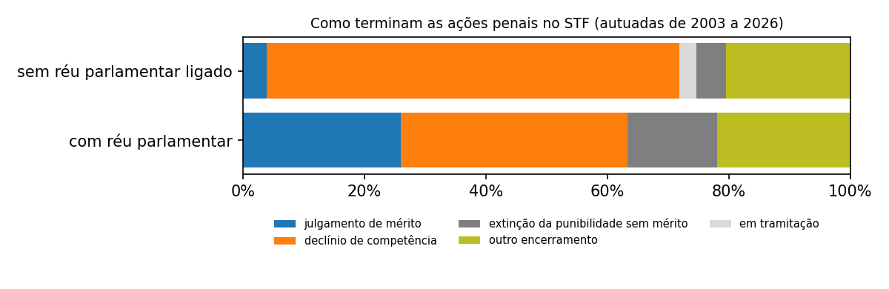
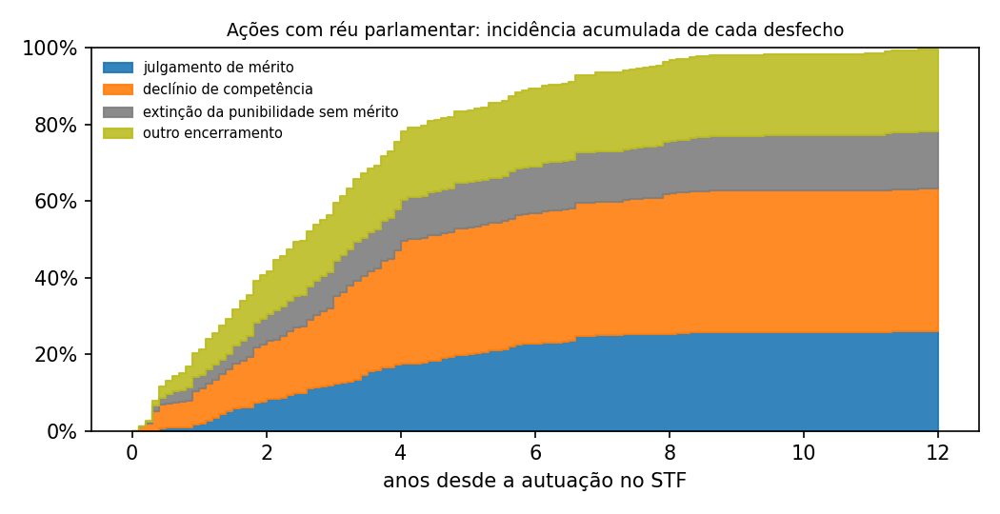
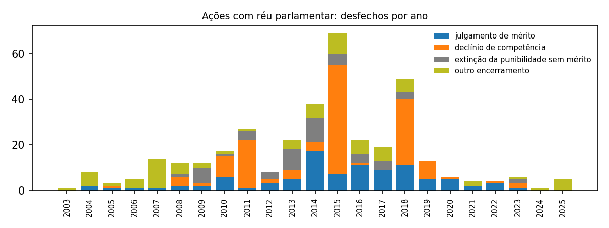

# O que acontece com as ações penais contra parlamentares no STF (2003-2026)

Nota técnica gerada por código a partir da base auditável (commit 788057b; `python -m src.relatorios.nota_foro`). Resultados (seções 2 a 4) separados da interpretação (seção 5). Status de pessoa é status formal, nunca culpa. Recomenda-se revisão jurídica antes de qualquer publicação.

## Resumo

- 365 ações penais com réu parlamentar federal foram autuadas no STF de 2003 a 2026; 95 (26,0%) terminaram com julgamento de mérito e 270 (74,0%) deixaram o STF sem julgamento de mérito. *(Fonte: `relatorios/tabelas/foro_acoes.csv`; `relatorios/tabelas/foro_desfechos.csv`; fontes FNT-000046, FNT-000233, FNT-000234 e mais 32; D-068)*
- O desfecho mais frequente foi o declínio de competência: 136 ações (37,3%) saíram do STF para outra instância sem julgamento. *(Fonte: `relatorios/tabelas/foro_desfechos.csv`; D-068)*
- Metade das ações deixa o STF em até 2,5 anos da autuação (mediana; intervalo de 95% de 2,1 a 2,8 anos). *(Fonte: `relatorios/tabelas/foro_tempos.csv`; D-068)*
- Quando o parlamentar é julgado no mérito, o último status registrado é de absolvição em 66 casos e de condenação em 24; outros 27 terminaram em prescrição. *(Fonte: `relatorios/tabelas/foro_pessoas.csv`; D-065, D-066)*
- A diferença entre partidos na proporção de ações julgadas no mérito não se distingue do acaso (p = 0,166), e a proporção não acompanha a posição ideológica (p = 0,266); é maior entre réus de partidos da base do governo (30,7%) do que da oposição (18,5%; p = 0,049), na direção oposta à do declínio (D-067). *(Fonte: `relatorios/tabelas/foro_simetria.csv`; `relatorios/tabelas/foro_simetria_testes.csv`; D-068, D-050, D-062)*

## 1. Pergunta, dados e método

Pergunta: o que acontece, e em quanto tempo, com as ações penais contra deputados federais e senadores no Supremo Tribunal Federal, onde tramitam por causa do foro por prerrogativa de função. A mesma medição vale para réus de qualquer partido. *(Fonte: D-068)*

Universo: 649 ações penais originárias do STF da lista lida (autuadas de 2003 em diante; 11 anteriores ficam fora), das quais 365 têm réu parlamentar federal ligado por nome civil ou ligação curada (381 pares parlamentar x ação). Os réus de cada ação vêm da leitura da aba Partes do portal do STF (relatórios em `data/raw/stf/*/stf_relatorio_navegacao_partes_ap_lote*.md`, registrados em `buscas` como registro auxiliar). As demais (284) servem de contraste descritivo. *(Fonte: `relatorios/tabelas/foro_cobertura.csv`; fontes FNT-000046, FNT-000233, FNT-000234 e mais 32; D-048, D-065)*

Desfecho, um por ação, pela hierarquia: julgamento de mérito > declínio de competência > em tramitação > extinção da punibilidade sem mérito > acordo homologado > outro encerramento. O tempo vai da autuação no STF até a primeira decisão do desfecho; ações em tramitação são censuradas em 23/09/2026 (6 ações com réu parlamentar seguem no acervo do STF depois do desfecho, em recurso ou execução).  A mediana vem da curva de Kaplan-Meier e a incidência de cada desfecho do estimador de Aalen-Johansen (riscos competitivos). *(Fonte: D-068)*

## 2. Como as ações terminam

| Desfecho | Ações com réu parlamentar | % | Demais ações | % |
|---|---|---|---|---|
| julgamento de mérito | 95 | 26,0% | 11 | 3,9% |
| declínio de competência | 136 | 37,3% | 193 | 68,0% |
| em tramitação | 0 | 0,0% | 8 | 2,8% |
| extinção da punibilidade sem mérito | 54 | 14,8% | 14 | 4,9% |
| acordo homologado | 0 | 0,0% | 0 | 0,0% |
| outro encerramento | 80 | 21,9% | 58 | 20,4% |

*(Fonte: `relatorios/tabelas/foro_desfechos.csv`; D-068)*

"Outro encerramento" reúne ações baixadas sem decisão registrada de mérito, declínio, extinção ou acordo. Pelo texto da última decisão final (sensibilidade, sem mudar a categoria): não identificado no texto: 28; extinção ou prescrição (texto): 13; declínio ou remessa (texto): 13; sem decisão final na exportação: 9; arquivamento (texto): 7; decisão em segredo de justiça ou sigilosa: 6; trancamento ou anulação (texto): 4. *(Fonte: `relatorios/tabelas/foro_outro_detalhe.csv`; D-068)*

## 3. Quanto tempo

Nas ações com réu parlamentar, a mediana até a saída do STF é 2,5 anos; nas demais ações, 0,28 anos. *(Fonte: `relatorios/tabelas/foro_tempos.csv`; D-068)*

| Até | Julgamento de mérito | Declínio | Extinção sem mérito | Outro encerramento |
|---|---|---|---|---|
| 2 anos | 8,2% | 15,3% | 6,8% | 11,2% |
| 4 anos | 17,5% | 32,1% | 10,7% | 17,8% |
| 8 anos | 25,2% | 36,7% | 13,7% | 21,1% |

Incidência acumulada com riscos competitivos: parcela das ações com réu parlamentar que já teve cada desfecho até o prazo. *(Fonte: `relatorios/tabelas/foro_tempos.csv`; D-068)*

## 4. Recortes

### 4.1 Origem da ação

281 ações com réu parlamentar chegaram ao STF vindas de outra instância (por exemplo, com a diplomação do réu) e 84 foram autuadas no próprio STF. Das vindas de outra instância, 38,1% voltaram por declínio, contra 34,5% das autuadas no STF; o julgamento de mérito alcança 25,3% e 28,6%, respectivamente. *(Fonte: `relatorios/tabelas/foro_desfechos_recortes.csv`; D-068)*

### 4.2 Antes e depois da restrição do foro (maio de 2018)

Só 15 ações com réu parlamentar foram autuadas depois da restrição, contra 350 antes; a comparação de desfechos entre as coortes não tem casos suficientes. Na série anual, os anos com mais declínios são 2015 (48 ações, início de legislatura); 2018 (29 ações, ano da restrição do foro); 2011 (21 ações, início de legislatura). No início de cada legislatura, parlamentares que não se reelegeram perdem o foro, e a ação volta à instância de origem. *(Fonte: `relatorios/tabelas/foro_desfechos_recortes.csv`; `relatorios/tabelas/foro_serie_anual.csv`; D-068)*

### 4.3 Pessoas

| Último status registrado (parlamentar x ação) | Quantidade |
|---|---|
| sem status de pessoa; a ação terminou em declínio de competência | 133 |
| sem status de pessoa; a ação terminou em outro encerramento | 80 |
| absolvido | 66 |
| prescrição reconhecida | 27 |
| condenado por tribunal superior | 24 |
| sem status de pessoa; a ação terminou em extinção da punibilidade sem mérito | 18 |
| punibilidade extinta | 14 |
| réu | 13 |
| sem status de pessoa; a ação terminou em julgamento de mérito | 5 |
| denúncia rejeitada | 1 |

*(Fonte: `relatorios/tabelas/foro_pessoas.csv`; D-065, D-066)*

### 4.4 Simetria

Proporção de ações encerradas com julgamento de mérito, por grupo do partido do réu na data da autuação: base do governo 30,7% (87 de 283), oposição 18,5% (12 de 65); p = 0,049. Entre partidos com 10 ou mais ações, p = 0,166; correlação com o escore ideológico, rho = -0,36 (p = 0,266). *(Fonte: `relatorios/tabelas/foro_simetria.csv`; `relatorios/tabelas/foro_simetria_testes.csv`; D-068, D-050, D-062)*

| Partido na autuação | Ações encerradas | Com mérito | % |
|---|---|---|---|
| MDB | 68 | 22 | 32,4% |
| DEM (registro encerrado, INS-000070) | 38 | 8 | 21,1% |
| PDT | 36 | 11 | 30,6% |
| PP | 34 | 11 | 32,4% |
| PT | 27 | 13 | 48,1% |
| PSDB | 26 | 3 | 11,5% |
| PTB (registro encerrado, INS-000062) | 26 | 11 | 42,3% |
| PL | 20 | 5 | 25,0% |
| PSB | 20 | 4 | 20,0% |
| PSD | 18 | 3 | 16,7% |
| PL (registro encerrado, INS-000064) | 13 | 3 | 23,1% |
| PSC (registro encerrado, INS-000085) | 11 | 3 | 27,3% |

*(Fonte: `relatorios/tabelas/foro_simetria.csv`; D-068)*

## 5. Interpretação (separada dos resultados)

1. **O foro funciona mais como etapa de passagem do que como instância de julgamento.** Cerca de 26% das ações com réu parlamentar chegam a julgamento de mérito no STF; as demais saem por declínio, extinção da punibilidade ou outro encerramento. Isso descreve o que acontece no STF; o que acontece depois do declínio, em outra instância, não está nesta base.
2. **O tempo pesa.** Com metade das ações saindo em cerca de 2,5 anos e a maior parte das saídas sem mérito, a prescrição e o fim do mandato (que leva ao declínio) competem com o julgamento. Os dados mostram a competição; não medem a intenção de ninguém.
3. **Quando há julgamento, a absolvição é mais frequente que a condenação** (66 contra 24 no último status de pessoa), o que não permite ler o foro como proteção automática nem como condenação garantida.
4. **Partido.** A diferença entre partidos não se distingue do acaso e não há associação com a posição ideológica; com dezenas de ações por partido, só diferenças grandes seriam detectadas. A diferença entre base do governo e oposição tem sentido estável com a do declínio (D-067): réus da oposição saem mais por declínio e, por isso, chegam menos ao mérito. Os dados não dizem o motivo; hipóteses como reeleição, renúncia ou perda de mandato por outras vias exigiriam dados de mandato por data.
5. **O que a nota não sustenta.** Ela não mede crimes cometidos, não mede inquéritos (sem lista de réus lida) e não acompanha a ação depois que sai do STF. A comparação antes e depois de 2018 não tem casos suficientes.

## 6. Limitações

- Unidade de tempo começa na autuação da ação penal no STF, não na denúncia nem nos fatos; ações que vieram de outra instância já tinham tempo decorrido antes.
- A categoria do desfecho vem do tipo de decisão registrado no Corte Aberta; "outro encerramento" é heterogêneo (ver seção 2) e parte dele poderia ser declínio ou extinção pelo texto.
- A lista de réus do portal pode estar incompleta; o vínculo réu-parlamentar exige nome civil ou curadoria (D-065), o que deixa de fora ligações não confirmadas.
- Os testes por partido têm poucos casos por grupo; o limite completo do projeto está em `docs/limitacoes.md`.

## 7. Reprodução

`python -m src.analise.foro` e `python -m src.relatorios.nota_foro`; regras em D-068 (`docs/decisoes_metodologicas.md`); método geral em `docs/nota_metodologica.md`.

## Apêndice. Fontes citadas

| Id | Tipo | Título | Data de acesso | URL | sha256 (início) |
|---|---|---|---|---|---|
| FNT-000046 | oficial | STF, Corte Aberta: decisões em ações penais e inquéritos, 08/01/2003 a 23/09/2026 (exportação do painel) | 2026-09-24 | https://transparencia.stf.jus.br/extensions/decisoes/decisoes.html | 8298383015ad |
| FNT-000233 | judicial | STF, AP 470: página de acompanhamento processual (abas Partes e Andamentos) | 2026-09-25 | https://portal.stf.jus.br/processos/detalhe.asp?incidente=11541 |  |
| FNT-000234 | judicial | STF, AP 470: andamento de 23/10/2012 (Decisão de Julgamento, Tribunal Pleno, formação de quadrilha) | 2026-09-25 | https://portal.stf.jus.br/processos/detalhe.asp?incidente=11541 |  |
| FNT-000235 | judicial | STF, AP 470 EI (embargos infringentes): acórdão de 27/02/2014, julgamento conjunto dos embargos sobre quadrilha | 2026-09-26 | https://jurisprudencia.stf.jus.br/pages/search/sjur273411/false |  |
| FNT-000312 | oficial | STF, AP 1011: decisão monocrática publicada no DJe em 2017-08-23 (peça do portal) | 2026-09-30 | https://portal.stf.jus.br/processos/downloadPeca.asp?id=312495372&ext=.pdf | a3015f2cf936 |
| FNT-000313 | oficial | STF, AP 396: decisão monocrática publicada no DJe em 2019-10-18 (peça do portal) | 2026-09-30 | https://portal.stf.jus.br/processos/downloadPeca.asp?id=15341501774&ext=.pdf | 3683ea5f4ff6 |
| FNT-000314 | oficial | STF, AP 415: decisão monocrática publicada no DJe em 2013-09-02 (peça do portal) | 2026-09-30 | https://portal.stf.jus.br/processos/downloadPeca.asp?id=166278201&ext=.pdf | ec0df6057657 |
| FNT-000315 | oficial | STF, AP 451: decisão monocrática publicada no DJe em 2013-10-03 (peça do portal) | 2026-09-30 | https://portal.stf.jus.br/processos/downloadPeca.asp?id=173945413&ext=.pdf | ae300b16867d |
| FNT-000316 | oficial | STF, AP 467: decisão monocrática publicada no DJe em 2013-12-11 (peça do portal) | 2026-09-30 | https://portal.stf.jus.br/processos/downloadPeca.asp?id=189869518&ext=.pdf | 4e5c3336eca8 |
| FNT-000317 | oficial | STF, AP 545: decisão monocrática publicada no DJe em 2012-12-19 (peça do portal) | 2026-09-30 | https://portal.stf.jus.br/processos/downloadPeca.asp?id=116478450&ext=.pdf | b4c50f645fd7 |
| FNT-000318 | oficial | STF, AP 557: decisão monocrática publicada no DJe em 2014-10-24 (peça do portal) | 2026-09-30 | https://portal.stf.jus.br/processos/downloadPeca.asp?id=270950527&ext=.pdf | 25701ce080c7 |
| FNT-000319 | oficial | STF, AP 650: decisão monocrática publicada no DJe em 2014-11-12 (peça do portal) | 2026-09-30 | https://portal.stf.jus.br/processos/downloadPeca.asp?id=278113709&ext=.pdf | b51cf9b761ff |
| FNT-000320 | oficial | STF, AP 582: decisão monocrática publicada no DJe em 2014-06-18 (peça do portal) | 2026-09-30 | https://portal.stf.jus.br/processos/downloadPeca.asp?id=237513957&ext=.pdf | cfa3beec2eca |
| FNT-000321 | oficial | STF, AP 584: decisão monocrática publicada no DJe em 2014-04-28 (peça do portal) | 2026-09-30 | https://portal.stf.jus.br/processos/downloadPeca.asp?id=217186046&ext=.pdf | d071e2d17ed5 |
| FNT-000322 | oficial | STF, AP 593: decisão monocrática publicada no DJe em 2013-10-03 (peça do portal) | 2026-09-30 | https://portal.stf.jus.br/processos/downloadPeca.asp?id=174003988&ext=.pdf | 9038da775e65 |
| FNT-000323 | oficial | STF, AP 597: decisão monocrática publicada no DJe em 2014-02-10 (peça do portal) | 2026-09-30 | https://portal.stf.jus.br/processos/downloadPeca.asp?id=199527020&ext=.pdf | 401c891e2521 |
| FNT-000324 | oficial | STF, AP 607: decisão monocrática publicada no DJe em 2015-08-06 (peça do portal) | 2026-09-30 | https://portal.stf.jus.br/processos/downloadPeca.asp?id=307366999&ext=.pdf | 72586014bb06 |
| FNT-000325 | oficial | STF, AP 615: decisão monocrática publicada no DJe em 2012-12-03 (peça do portal) | 2026-09-30 | https://portal.stf.jus.br/processos/downloadPeca.asp?id=113938234&ext=.pdf | b8564b5a2552 |
| FNT-000326 | oficial | STF, AP 624: decisão monocrática publicada no DJe em 2013-03-07 (peça do portal) | 2026-09-30 | https://portal.stf.jus.br/processos/downloadPeca.asp?id=127180086&ext=.pdf | 58050c46d57b |
| FNT-000327 | oficial | STF, AP 642: decisão monocrática publicada no DJe em 2013-10-03 (peça do portal) | 2026-09-30 | https://portal.stf.jus.br/processos/downloadPeca.asp?id=173972400&ext=.pdf | 368ec62e665c |
| FNT-000328 | oficial | STF, AP 648: decisão monocrática publicada no DJe em 2015-09-04 (peça do portal) | 2026-09-30 | https://portal.stf.jus.br/processos/downloadPeca.asp?id=307652156&ext=.pdf | 82d9ab4aa41d |
| FNT-000329 | oficial | STF, AP 673: decisão monocrática publicada no DJe em 2013-09-24 (peça do portal) | 2026-09-30 | https://portal.stf.jus.br/processos/downloadPeca.asp?id=171699154&ext=.pdf | 2419e55aed34 |
| FNT-000330 | oficial | STF, AP 675: decisão monocrática publicada no DJe em 2013-12-11 (peça do portal) | 2026-09-30 | https://portal.stf.jus.br/processos/downloadPeca.asp?id=189869508&ext=.pdf | 98ec6b2dc594 |
| FNT-000331 | oficial | STF, AP 690: decisão monocrática publicada no DJe em 2013-04-11 (peça do portal) | 2026-09-30 | https://portal.stf.jus.br/processos/downloadPeca.asp?id=133172433&ext=.pdf | 144b4be7042a |
| FNT-000332 | oficial | STF, AP 696: decisão monocrática publicada no DJe em 2014-03-06 (peça do portal) | 2026-09-30 | https://portal.stf.jus.br/processos/downloadPeca.asp?id=203935668&ext=.pdf | 6053e8689a3d |
| FNT-000333 | oficial | STF, AP 699: decisão monocrática publicada no DJe em 2013-04-23 (peça do portal) | 2026-09-30 | https://portal.stf.jus.br/processos/downloadPeca.asp?id=135371353&ext=.pdf | 58da7ea214aa |
| FNT-000334 | oficial | STF, AP 702: decisão monocrática publicada no DJe em 2015-02-24 (peça do portal) | 2026-09-30 | https://portal.stf.jus.br/processos/downloadPeca.asp?id=302867141&ext=.pdf | c205eeff6c91 |
| FNT-000335 | oficial | STF, AP 854: decisão monocrática publicada no DJe em 2014-03-13 (peça do portal) | 2026-09-30 | https://portal.stf.jus.br/processos/downloadPeca.asp?id=205841398&ext=.pdf | 3c767cde9f90 |
| FNT-000336 | oficial | STF, AP 868: decisão monocrática publicada no DJe em 2014-05-19 (peça do portal) | 2026-09-30 | https://portal.stf.jus.br/processos/downloadPeca.asp?id=222186348&ext=.pdf | 7c02a89459e3 |
| FNT-000337 | oficial | STF, AP 939: decisão monocrática publicada no DJe em 2017-05-29 (peça do portal) | 2026-09-30 | https://portal.stf.jus.br/processos/downloadPeca.asp?id=311894551&ext=.pdf | 8425f99d26d8 |
| FNT-000338 | oficial | STF, AP 952: decisão monocrática publicada no DJe em 2018-10-11 (peça do portal) | 2026-09-30 | https://portal.stf.jus.br/processos/downloadPeca.asp?id=15338828862&ext=.pdf | 9bb2df39c9d0 |
| FNT-000339 | oficial | STF, AP 961: decisão monocrática publicada no DJe em 2018-06-07 (peça do portal) | 2026-09-30 | https://portal.stf.jus.br/processos/downloadPeca.asp?id=314532778&ext=.pdf | 16168143fc6b |
| FNT-000340 | oficial | STF, AP 969: decisão monocrática publicada no DJe em 2023-08-31 (peça do portal) | 2026-09-30 | https://portal.stf.jus.br/processos/downloadPeca.asp?id=15360649155&ext=.pdf | 4a992f78eec9 |
| FNT-000341 | oficial | STF, AP 983: decisão monocrática publicada no DJe em 2018-03-09 (peça do portal) | 2026-09-30 | https://portal.stf.jus.br/processos/downloadPeca.asp?id=313862614&ext=.pdf | 3157070ae75d |
| FNT-000342 | oficial | STF, AP 988: decisão monocrática publicada no DJe em 2017-10-23 (peça do portal) | 2026-09-30 | https://portal.stf.jus.br/processos/downloadPeca.asp?id=313078885&ext=.pdf | 7b80928ff1dd |
